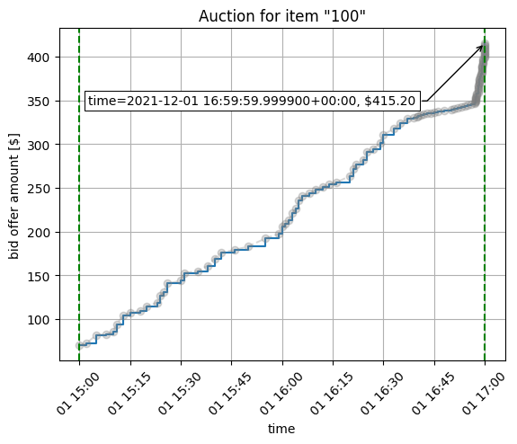

# closed-auction-metrics

text / call Austin Clark for details 703-785-1134.

## Overview

This microservice (context) deals with analyzing auctions that are over. It is written in python to make use of the many existing packages in python for data analysis activities. These include the creation of fancy graphics (e.g. `matplotlib`, `bokeh`) and any machine learning activities (e.g. `scikit-learn`, `tensorflow`).

Clarifying Note: there are various terms used to describe the lifecycle of an auction. In the `auctions-service`, an auction advances through states based on time elapsation: `PENDING -> ACTIVE -> OVER`. When an auction is in the `PENDING` or `ACTIVE` state, circumstances permitting the auction may be canceled or stopped by a client. In either case, the Auction goes to a `CANCELED` state. In periodic intervals, the `auctions-service` introspects and looks for auctions that are `CANCELED` or `OVER`. If it finds either of these, it will process the end result of that auction (e.g. declare and announce a winner if an auction is `OVER`), and it will advance the Auction to a `FINALIZED` state. When an auction is `FINALIZED`, it means that its result has been determined, and it has been "archived". Its contents are frozen and cannot be mutated. An auction's state is determined by an internal function, injecting a `datetime` object. This allows us to perform retroactive analysis such as being able to determine an Auction's state at a given time. It was thought this could lead to flexible behavior. For example, we could stamp a bid with a time when it was received, and we can at a later point in time process the bid as if we were processing it when it was received (rather than what it was analyzed).

When the `auctions-service` finalizes an auction, it wraps up all data related to the auction and sends to the `closed-auction-metrics` context over a RabbitMQ queue. This context will persist the data it receives. This context has a notable `ClosedAuction` class in the domain logic, which holds the raw data on the auction and is meant to have methods that can compute other metrics from the raw data--or generate visualizations.

As of `11/23/2022`, the only implemented functionality for this context is basic CRUD (e.g. save, get data on closed auctions) and basic visualization. Save only occurs with incoming RabbitMQ messages from the `auctions-service`. Get type calls are invoked through API endpoints. There is a get endpoint to generate a graph visualization (as html) of a `ClosedAuction`'s bid history.



Mongodb was chosen to allow schema flexibility, which is suitable for this context because it has an unknown future about what kind of data it will want to persist (e.g. results of expensive calculations, models, graphics,...?). Database management workflow is simplified (i.e. it is easy to rethink how or what data is stored).

## Developer notes

* currently, little-to-no tests are written for this context; it has a small interface and is unlikely to see further changes (hence the decision to not bother writing tests once desired functionality was confirmed by inspection)
* One drawback to choosing Mongodb was that Mongodb stores time only up to millisecond precision. Our auction data uses times with microsecond precision; for now, this issue was side-stepped by storing a string representation of the time with full precision (e.g. `"2022-01-01 13:20:30.003020"`) and storing a datetime-like object that holds up to millisecond precision (e.g. `ISO-Date (2022-01-01 13:20:30.003)`). This allows us to keep the full precision by storing the string field, which we parse as the official time when we reconstitute a `ClosedAuction` from the database. It also allows us to perform queries in the database for `ClosedAuction`s by time by storing the datetime object at millisecond precision.

## Architecture

This context uses a layered architecture with code written python. mongodb is used for storage.
This context has little to no tests.

```
|-- closed-auction-metrics
|   |-- Dockerfile
|   |-- api_main.py
|   |-- insert_starter_auction_data_into_mongo.py
|   |-- src/
|   |   |-- application/
|   |   |   |-- closed_auction_metrics_service.py
|   |   |   |-- ...
|   |   |-- domain/
|   |   |   |-- closed_auction.py
|   |   |   |   |-- ...
|   |   |-- infrastructure/
|   |   |   |-- utils.py
|   |   |-- db/
|   |   |   |-- ...
```

An `application` layer holds code dealing with the interface for the service. `domain` contains domain logic code (e.g. classes like `ClosedAuction`). `infrastructure` contains commonly used functions, and `db` contains files I use to help myself generate seed data (if I want to debug).

`api_main.py` is the entrypoint for the microservice (the "main" function). This script creates two subprocesses that invoke the microservice upon RabbitMQ messages or invocations of the RESTful API. 

## persistence

`insert_starter_auction_data_into_mongo.py` is a script I have been using to seed the mongo db with certain data. An alternative seeding approach is to upload the `src/db/init` folder into the mongo intitialization script directory for the mongo container (`/docker-entrypoint-initdb.d`). However, I could not manage to generate json time data correctly with this approach, so I have been using `insert_starter_auction_data_into_mongo.py` instead.

a docker-volume  `mongodata` is created and mounted to `data/db` (where the mongo db container stores data). This enables persistence of data between `docker-compose up -d` and `docker-compose down` calls. If the user wishes to clear out the database and start from an empty database, they do a `docker volume rm project-dir_mongodata` call, which deletes the local docker-volume storing the persisted data on the host-system. The next call to  `docker-compose up -d` will create the docker-volume again from scratch, so the mongo database will be empty. When the system is brought down with `docker-compose down`, the data in the mongo container will be saved to the docker-volume on the host machine. Upon the next call to `docker-compose up -d`, the mongo container will recognize data from the host's system, and it will load that data into the database. For now, if the user wants to seed the mongo db with data, they have to do `docker-compose up -d` to bring up at least the `mongo-server` container and the `closed-auction-metrics` container. They then run `python3 insert_starter_auction_data_into_mongo.py` within the `closed-auction-metrics` service container. This will insert data into the database/collection.

## deployment

The service involves 3 containers: a container for the actual service `closed-auction-metrics`, a container for the persistence with mongo db (`mongo-server`), and a container for the RabbitMQ instance (`rabbitmq-server`) (in full deployment, this service would share a RabbitMQ container with other microservices).

If firing up just this microservice, perform a docker-compose call using `docker-compose.yml`
```
$ docker-compose up -d
```

turn down with
```
$ docker-compose down
```

## to run tests 

There are little-to-no tests, but to run tests, use pytest with verbose and print-to-std-out flags.

E.g., cd to `domain/` and run
```
$ pytest tests/ -vs
```

Due to imports some tests might have to be run like so

```
$ python3 -m pytest domain/tests/test_auction.py  -vs
```

## starting the application

If firing up just this microservice, perform a docker-compose call using `docker-compose.yml`
```
$ docker-compose up -d
```

turn down with
```
$ docker-compose down
```